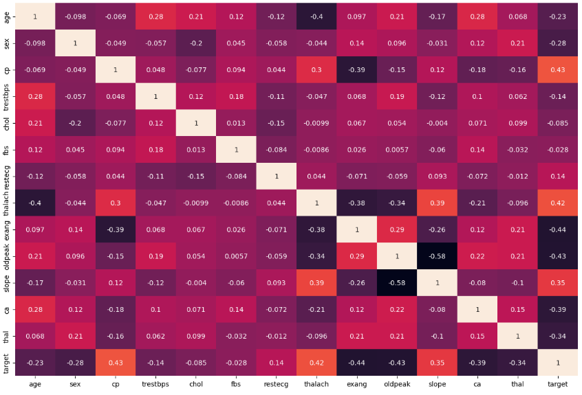
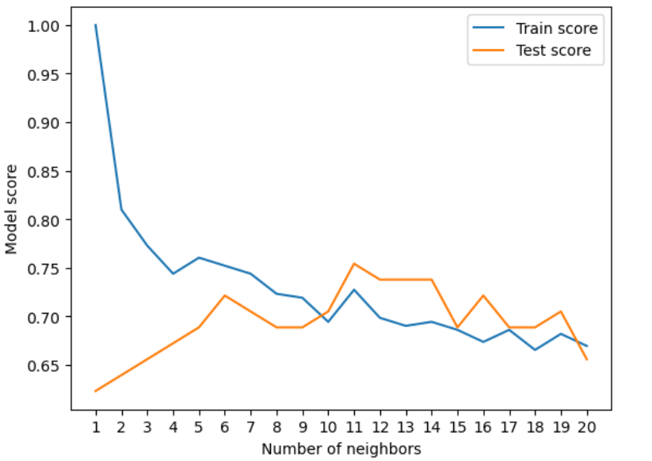
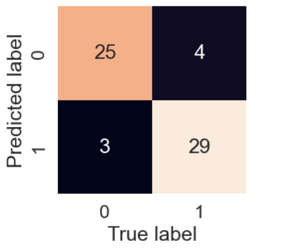
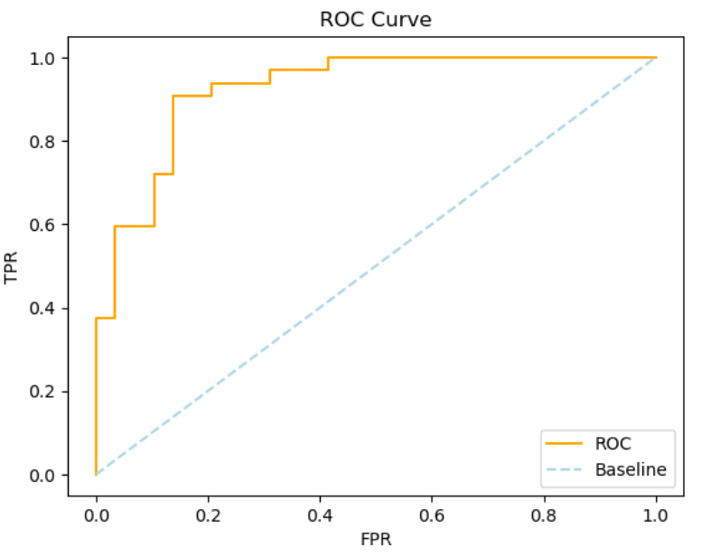

# Heart Disease Prediction using Machine Learning

## Project Overview
This project aims to **predict the presence of heart disease** in patients based on clinical parameters such as age, sex, cholesterol, and blood pressure. The model leverages supervised machine learning algorithms to help in **early detection** and **risk assessment** of cardiovascular diseases.

---

### Dataset:
| Feature | Description |
|----------|-------------|
| age | Age of the patient |
| sex | Gender (1 = male, 0 = female) |
| cp | Chest pain type (4 values) |
| trestbps | Resting blood pressure |
| chol | Serum cholesterol (mg/dl) |
| fbs | Fasting blood sugar > 120 mg/dl (1 = true, 0 = false) |
| restecg | Resting ECG results |
| thalach | Maximum heart rate achieved |
| exang | Exercise induced angina |
| oldpeak | ST depression induced by exercise |
| slope, ca, thal | Additional ECG-related parameters |
| target | 1 = heart disease, 0 = no heart disease |

---

## Methodology

### 1. **Data Preprocessing**
- Checked for missing values  
- Encoded categorical variables  
- Scaled features

### 2. **Exploratory Data Analysis (EDA)**
- Visualized correlations among variables  

**Correlation Matrix:**  

---

### 3. **Model Building**
Trained and compared the performance of:
1. **Logistic Regression**  
2. **K-Nearest Neighbors (KNN)**  
3. **Random Forest Classifier**

**KNN Model Visualization:**  

---

### 4. **Model Evaluation**

**Confusion Matrix:**  

**ROC Curve:**  

---

## Results
| Model | Accuracy after Hyperparameter Tuning |
|--------|-----------|
| KNN | 75.41% |
| Logistic Regression | 88.52% | 
| Random Forest | 86.88% |

**Logistic Regression** achieved the highest accuracy and generalization.

---

## Installation

1\. Clone the repository:

    git clone https://github.com/AShr12xz/Heart_Disease_Classification_Project.git
    cd Heart_Disease_Classification_Project

2️\. Install dependencies:

    pip install pandas numpy scikit-learn matplotlib seaborn
    
3\. Run the notebook Heart_Disease.ipynb

---

## Technologies Used

| Category | Tools / Libraries |
|-----------|-------------------|
| **Programming Language** | Python 3.8+ |
| **Data Handling** | pandas, numpy |
| **Data Visualization** | matplotlib, seaborn |
| **Machine Learning** | scikit-learn |
| **Notebook Environment** | Jupyter Notebook |

